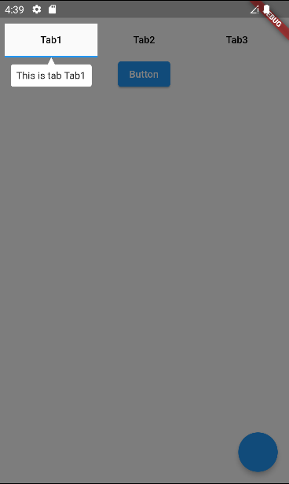
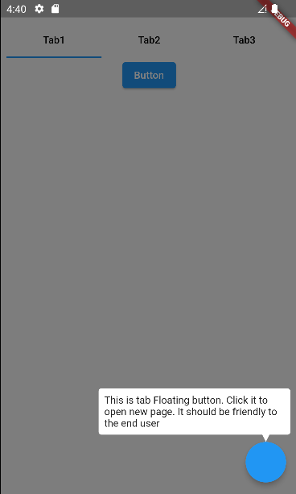

## Flutter User Guildance
Provide the user guildance widget to make developers easy to make new user tips.

## Screen
|  |  |
| :-----:| :----: |
|  |  |


## Simple Example
```dart
class _SimplePageState extends State<SimplePage> {
  UserGuidanceController userGuidanceController = UserGuidanceController();

  @override
  Widget build(BuildContext context) {
    return UserGuidance(
      controller: userGuidanceController,
      opacity: 0.5,
      child: Scaffold(
        floatingActionButton: UserGuildanceAnchor(
            index: 1,
            tag: "This is tab Floating button.",
            child: FloatingActionButton(
              onPressed: () {
                userGuidanceController.show();
              },
            )),
        body: SafeArea(
          child: Padding(
            padding: const EdgeInsets.all(40.0),
            child: UserGuildanceAnchor(
              index: 2,
              tag: "Start press the button",
              child:
                  ElevatedButton(onPressed: () {}, child: const Text("Button")),
            ),
          ),
        ),
      ),
    );
  }

  @override
  void dispose() {
    userGuidanceController.dispose();
    super.dispose();
  }
}
```

## Complex Example
```dart
class _HomePageState extends State<HomePage> {
  UserGuidanceController userGuidanceController = UserGuidanceController();
  var tabs = ["Tab1", "Tab2", "Tab3"];

  @override
  void dispose() {
    userGuidanceController.dispose();
    super.dispose();
  }

  @override
  Widget build(BuildContext context) {
    return UserGuidance(
      controller: userGuidanceController,
      opacity: 0.5,
      slotBuilder: (context, data) {
        if (data?.index == 1) {
          return BoxDecoration(
            color: Colors.white,
            borderRadius: BorderRadius.circular(data!.position.height / 2.0),
          );
        }
        return null;
      },
      tipBuilder: (context, data) {
        if (data != null) {
          return TipWidget(
            child: ConstrainedBox(
                constraints: const BoxConstraints(maxWidth: 250.0),
                child: Text("${data.tag}")),
            data: data,
          );
        }

        return null;
      },
      child: DefaultTabController(
          length: tabs.length,
          child: Scaffold(
            floatingActionButton: UserGuildanceAnchor(
                index: 1,
                tag:
                    "This is tab Floating button. Click it to open new page. It should be friendly to the end user",
                child: FloatingActionButton(
                  onPressed: () {
                    userGuidanceController.show();
                  },
                )),
            body: SafeArea(
              child: Padding(
                padding: const EdgeInsets.all(8.0),
                child: Column(children: [
                  TabBar(
                      tabs: tabs.map<Widget>((txt) {
                    var subIndex = tabs.indexOf(txt);
                    return Tab(
                        child: UserGuildanceAnchor(
                            index: 0,
                            subIndex: subIndex,
                            reportType: AnchorReportParentType.tab,
                            tag: "This is tab $txt",
                            child: Text(
                              txt,
                              style: const TextStyle(color: Colors.black),
                            )));
                  }).toList()),
                  UserGuildanceAnchor(
                    index: 2,
                    tag: "Start press the button",
                    adjustRect: (rect) {
                      return Rect.fromLTWH(rect.left, rect.top + 5.0,
                          rect.width, rect.height - 10.0);
                    },
                    child: ElevatedButton(
                        onPressed: () {}, child: const Text("Button")),
                  ),
                  Expanded(
                      child: TabBarView(
                    children: tabs.map<Widget>((txt) => Container()).toList(),
                  ))
                ]),
              ),
            ),
          )),
    );
  }
}
```
